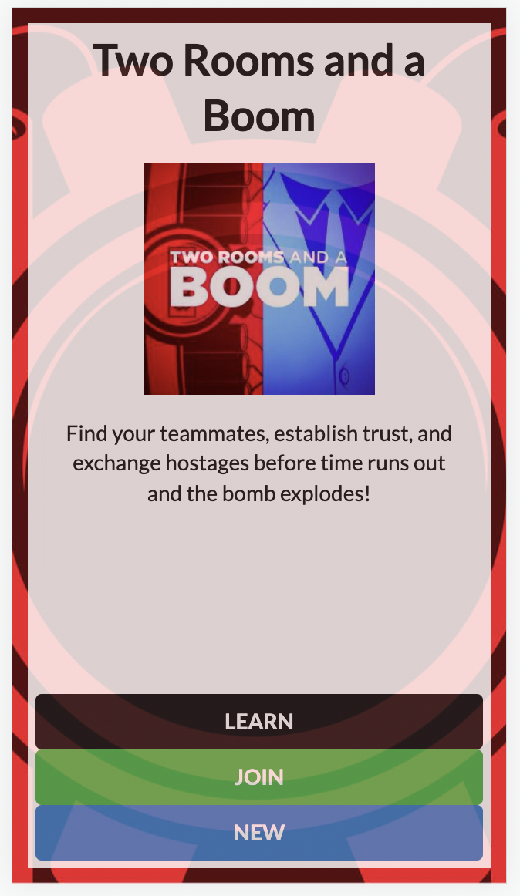
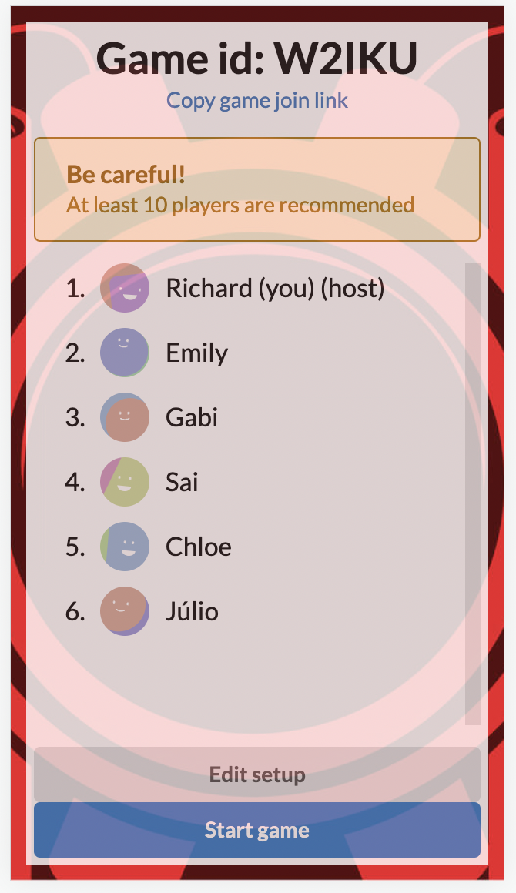
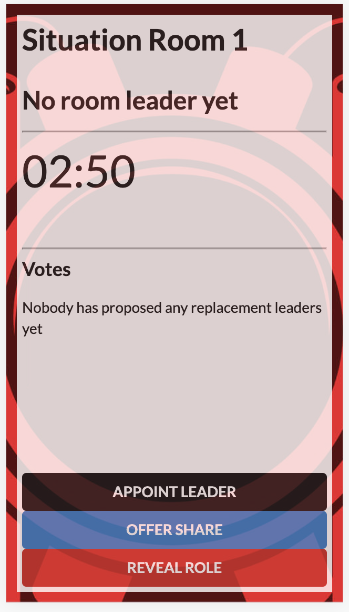
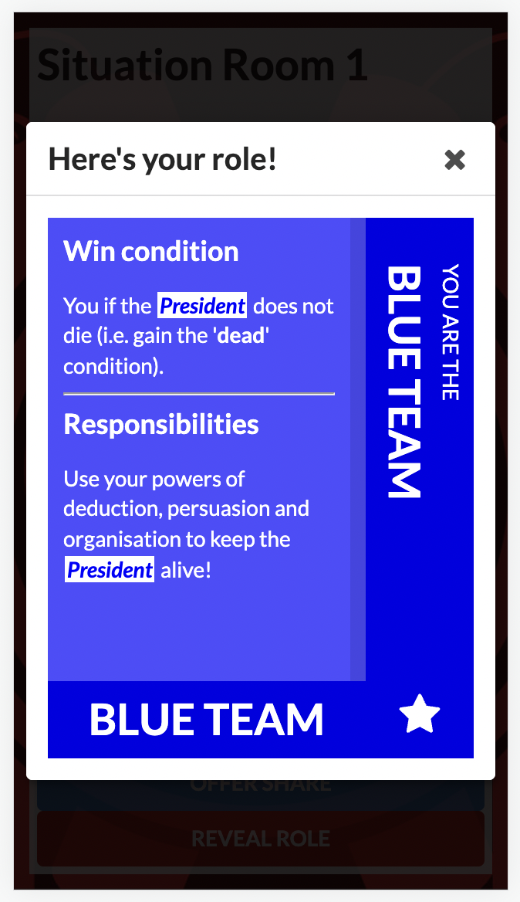

# Cockroach Poker

  
  
  
  

**Cockroach Poker** is a non-gambling social bluffing game (with little to do with traditional poker).

It is for **3-6 players**, and games take **as little as 15 minutes**.

This repo is is a (work-in-progress) web app implementation of it, as a replacement for the card set if you don't have immediate access. (You should buy the physical set, though - it's fun!)